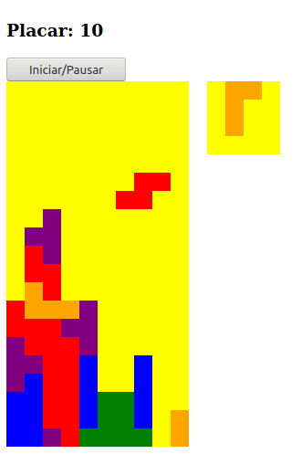
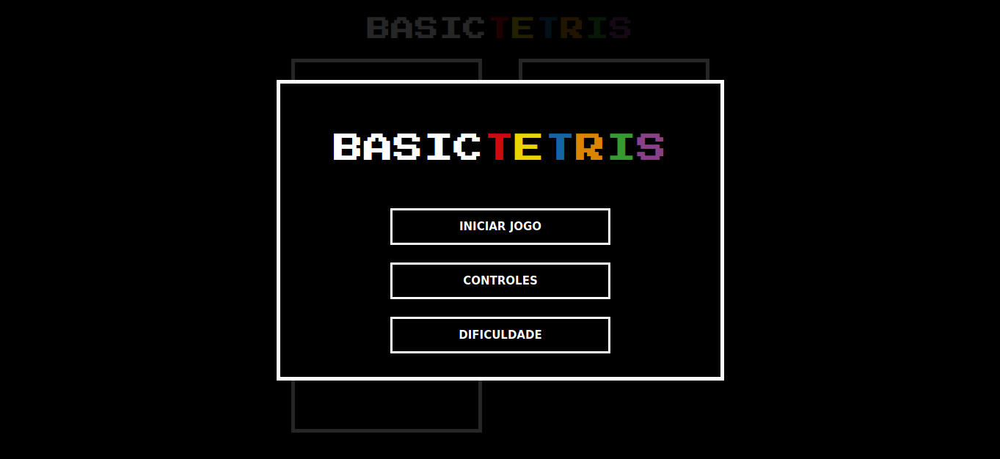
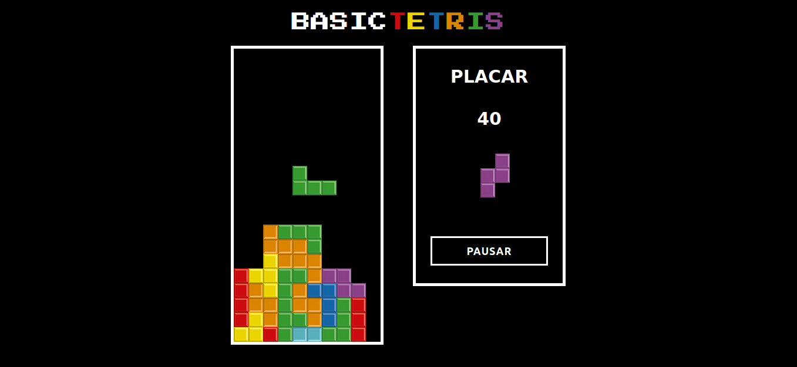

# Tetris Básico

Mini-projeto desenvolvido para obtenção de nota na disciplina IF977 - Engenharia de Software, do curso de Sistemas de Informação, da Universidade Federal de Pernambuco.

## Descrição

Jogo de Tetris básico desenvolvido com JavaScript Vanilla. Pode ser acessado [aqui](https://lucaxfelis.github.io/tetris-js/).

### Funcionalidades
* Sistema de pontuação
* Níveis de dificuldade
* Pausar e retornar ao jogo

## Autores
* Gabriel Vanderlei Oliveira
* Lucas Felix de Aguiar
* Samuel Ferreira de Farias Barbosa

## Fases do projeto

Jogo em sua primeira versão

Menu inicial em sua versão atual

Jogo em sua versão atual

